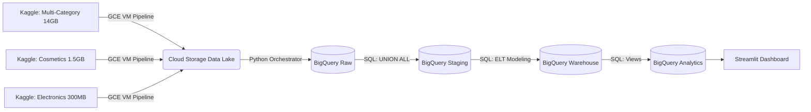

<div align="center">
  
# 🚀 Enterprise Multi-Vendor E-Commerce Data Platform
**A Massive Big Data ELT Pipeline on Google Cloud Platform (GCP)**


</div>

Welcome to the **Multi-Vendor E-Commerce Data Platform**! What started as a local Pandas project has evolved into a highly-scalable cloud architecture on Google Cloud Platform. This project ingests, processes, and unifies **133+ million rows of data (16GB+)** across three different simulated company acquisitions into a single, cohesive BigQuery Data Warehouse.

> ⚡ **Future Ready:** While currently executing batch ELT workloads, this decoupled architecture is designed to be easily adaptable for **continuous data flow streaming** (via Pub/Sub and Dataflow) to power live, real-time analytics!

---

## 🏗️ Architecture & Scale

This pipeline is built to handle massive data volumes natively in the cloud, completely bypassing local compute bottlenecks.



### The Big Data Footprint
- **Total Raw Data:** ~16 Gigabytes of clickstream logs and transactional history.
- **Row Count:** 133,277,104 events unified into a single schema.
- **Performance:** BigQuery processes the entire ELT transformation (from Raw to Analytics views) in under **30 seconds**.
- **Final Metrics:** Powers a live dashboard analyzing **1.9 Million Orders** and **$628 Million in Revenue**.

---

## 🛠️ Technology Stack

This project was built utilizing modern data engineering principles, leveraging a blend of local processing engines and hyperscale cloud infrastructure:

- **Cloud Platform:** Google Cloud Platform (GCP)
- **Data Lake:** Google Cloud Storage (GCS)
- **Data Warehouse:** Google BigQuery *(Serverless, Columnar, partitioned & clustered)*
- **Local Database:** PostgreSQL *(for local incremental load testing)*
- **Data Orchestration:** Python (`google-cloud-bigquery`), Bash Shell Scripting
- **Data Processing:** Pandas, SQL (BigQuery Standard SQL)
- **Data Visualization:** Python, Streamlit, Plotly Express
- **AI Acceleration:** Generative AI (Antigravity/Gemini) for rapid SQL migration and UI scaffolding.

---

## 💡 Skills Demonstrated

| Area | Concepts & Techniques Applied |
|------|-----------------------------|
| **Data Engineering** | Cloud ELT pipelines, Data Lake architecture, automated ingestion |
| **Cloud (GCP)** | Compute Engine VMs, Cloud Storage (GCS), BigQuery orchestration |
| **Data Warehousing** | Star Schema design, dimensional modeling, partitioning & clustering |
| **Advanced SQL** | `UNION ALL` schema merging, Window functions, CTEs, Data Type Casting |
| **Python** | SDK Integration (`google-cloud-bigquery`), UI development (Streamlit), Data Quality |
| **Business Intelligence** | Executive KPI modeling, live dashboarding, time-series revenue tracking |

---

## 📂 Project Structure & File Guide

```text
ecommerce-analytics-pipeline/
│
├── src/
│   ├── gcp_kaggle_download_vendors.sh # Bash automation to stream Kaggle -> GCS
│   ├── gcp_load.py                    # Python orchestrator triggering BQ Load Jobs
│   └── dashboard.py                   # Live Streamlit dashboard connecting to BQ
│
├── sql/
│   ├── staging/
│   │   └── 01_raw_to_staging.sql      # Unifies 3 vendor schemas via UNION ALL & Casting
│   ├── warehouse/
│   │   ├── 01_populate_dim_date.sql   # Generates Date dimension spine (GENERATE_DATE_ARRAY)
│   │   ├── 02_populate_dimensions.sql # Populates dim_customer & dim_product
│   │   └── 03_populate_facts.sql      # Populates fact_orders & fact_order_items
│   └── analytics/
│       └── 01_create_views.sql        # 6 analytical views (KPIs, revenue, products, etc.)
│
├── requirements.txt                   # Project dependencies (Streamlit, BigQuery, etc.)
└── README.md                          # You are here!
```

---

## 🚧 Challenges & Solutions

### 💥 Problem 1: Out-of-Memory (OOM) Errors on Local Hardware
**Challenge:** Initially, data processing was handled locally. Attempting to process 133 million rows (14GB) on a laptop instantly caused memory limits to crash the pipeline.
**Solution:** I discarded the local pipeline and fully migrated to an **ELT (Extract, Load, Transform)** architecture on GCP. Data is pulled directly into Google Cloud Storage via disposable Compute Engine VMs, and then immediately loaded into BigQuery where all transformations are handled by highly parallelized SQL.

### 💥 Problem 2: Looker Studio Server Constraints
**Challenge:** The original plan was to build the final visualization layer using Looker Studio. Unfortunately, I hit server connection limits during the dashboard creation phase, threatening to delay the project's deadline.
**Solution:** I immediately pivoted and developed a custom **Python Streamlit dashboard** connected live to BigQuery via the `google-cloud-bigquery` SDK. This guaranteed delivery before the deadline and provided a significantly more professional, developer-first presentation layer!

---

## 🤖 Leveraging AI to Accelerate Delivery

Building a multi-vendor cloud platform from scratch usually takes weeks. I extensively used **AI Coding Assistants** (Antigravity/Gemini) to dramatically accelerate the development timeline:
1. **Automated SQL Translation:** AI was used to instantly rewrite hundreds of lines of PostgreSQL staging scripts into optimized BigQuery Standard SQL, successfully handling complex data type mismatches.
2. **Dashboard Generation:** The Streamlit dashboard (`src/dashboard.py`) was scaffolded entirely via AI prompt engineering, complete with BigQuery authentication and Plotly visualizations, reducing a 2-day UI build into a 5-minute generation!

---

## 🛠️ How to Setup & Run

This project supports two execution modes: **Local Development** (via PostgreSQL) and **Cloud Production** (via GCP BigQuery).

### Option A: Local Pipeline (PostgreSQL)
Ideal for testing or running the pipeline on smaller subsets of data.

**1. Set up environment**
```bash
python3 -m venv venv
source venv/bin/activate
pip install -r requirements.txt
```

**2. Configure Database Credentials**
Edit `.env` with your PostgreSQL connection details:
```env
POSTGRES_HOST=127.0.0.1
POSTGRES_PORT=5432
POSTGRES_DB=ecommerce_db
POSTGRES_USER=postgres
POSTGRES_PASSWORD=your_password
```

**3. Create Database & Run Pipeline**
```bash
createdb ecommerce_db

# Full load (first run or complete refresh)
python -m src.main

# Incremental load (append new records only)
python -m src.main --mode incremental
```

---

### Option B: Cloud Pipeline (GCP BigQuery)
Required for processing the full 133M+ row datasets without Out-Of-Memory errors.

**1. Prerequisites & Authentication**
- A Google Cloud Project with Billing enabled.
- `gcloud` CLI installed locally.
```bash
gcloud auth application-default login
gcloud config set project your-project-id
```

**2. Setup Environment Variables**
Populate your `.env` file:
```env
GCP_PROJECT_ID="your-project-id"
GCP_BUCKET_NAME="your-bucket-name"
GCP_REGION="us-central1"
KAGGLE_USERNAME="your-username"
KAGGLE_KEY="your-key"
```

**3. Execute the Cloud Pipeline**
```bash
# 1. Download Data via VM to Cloud Storage
# (Run the bash scripts in src/ on a GCP Compute Engine VM)

# 2. Ingest to BigQuery
python src/gcp_load.py

# 3. Run Transformations
bq query --nouse_legacy_sql < sql/staging/01_raw_to_staging.sql
bq query --nouse_legacy_sql < sql/warehouse/01_populate_dim_date.sql
bq query --nouse_legacy_sql < sql/warehouse/02_populate_dimensions.sql
bq query --nouse_legacy_sql < sql/warehouse/03_populate_facts.sql
bq query --nouse_legacy_sql < sql/analytics/01_create_views.sql
```

**4. Launch the Streamlit Dashboard**
With the data loaded in BigQuery, start the live dashboard!
```bash
pip install -r requirements.txt
streamlit run src/dashboard.py
```
