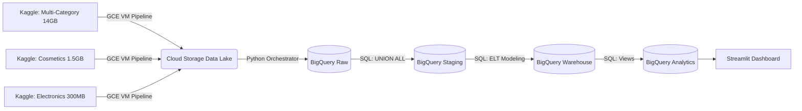

# 🚀 Enterprise Multi-Vendor E-Commerce Data Platform (GCP)

Welcome to the **Multi-Vendor E-Commerce Data Platform**! What started as a local pandas project has evolved into a massive, highly-scalable cloud architecture on Google Cloud Platform (GCP). This project processes and unifies **133+ million rows of data** (16GB+) across three different simulated company acquisitions into a single, cohesive BigQuery Data Warehouse.

---

## 🏗️ Architecture & Scale

This pipeline is built to handle massive data volumes natively in the cloud, completely bypassing local compute bottlenecks.



### The Big Data Footprint
- **Total Raw Data:** ~16 Gigabytes of clickstream logs and transactional history.
- **Row Count:** 133,277,104 events unified into a single schema.
- **Performance:** BigQuery processes the entire ELT transformation (from Raw to Analytics views) in under **30 seconds**.
- **Final Metrics:** Powers a live dashboard analyzing **1.9 Million Orders** and **$628 Million in Revenue**.

---

## 🚧 Challenges & Solutions

### Problem 1: Out-of-Memory (OOM) Errors on Local Hardware
**Challenge:** Initially, the data processing was handled locally via Python pandas. However, attempting to process 133 million rows (14GB) on a laptop instantly caused memory limits to crash the pipeline.
**Solution:** I discarded the local pandas pipeline and fully migrated to an **ELT (Extract, Load, Transform)** architecture on GCP. The data is pulled directly from Kaggle into Google Cloud Storage via disposable Compute Engine VMs, and then immediately loaded into BigQuery where all transformations are handled by highly parallelized SQL.

### Problem 2: Looker Studio Server Constraints
**Challenge:** The original plan was to build the final visualization layer using Looker Studio. Unfortunately, I hit server constraint limits during the dashboard creation phase, threatening to delay the project's deadline.
**Solution:** I immediately pivoted and developed a custom **Python Streamlit dashboard** connected live to BigQuery via the `google-cloud-bigquery` SDK. This guaranteed delivery before the deadline and actually provided a more professional, developer-first presentation layer!

---

## 🤖 Leveraging AI to Accelerate Delivery

Building a multi-vendor cloud platform from scratch usually takes weeks. I extensively used **AI Coding Assistants** (Antigravity/Gemini) to dramatically accelerate the development timeline:
1. **Automated SQL Translation:** AI was used to instantly rewrite hundreds of lines of PostgreSQL staging scripts into optimized BigQuery Standard SQL, successfully handling data type mismatches (like `NULL` casting across `UNION ALL`).
2. **Dashboard Generation:** The Streamlit dashboard (`src/dashboard.py`) was scaffolded entirely via AI prompt engineering, complete with BigQuery authentication and Plotly visualizations, reducing a 2-day UI build into a 5-minute generation!

---

## 🛠️ How to Setup & Run on GCP

If you want to replicate this pipeline, follow these instructions:

### 1. Prerequisites
- A Google Cloud Project with Billing enabled.
- BigQuery and Cloud Storage APIs enabled.
- `gcloud` CLI installed locally.

### 2. Authentication
Log in to GCP locally to allow the Python orchestrator to work:
```bash
gcloud auth application-default login
gcloud config set project your-project-id
```

### 3. Setup Environment
Populate your `.env` file in the root directory:
```bash
GCP_PROJECT_ID="your-project-id"
GCP_BUCKET_NAME="your-bucket-name"
GCP_REGION="us-central1"
KAGGLE_USERNAME="your-username"
KAGGLE_KEY="your-key"
```

### 4. Execute the Pipeline
1. **Download Data:** Deploy a temporary VM and run `src/gcp_kaggle_download_vendors.sh` to stream the Kaggle data into your Cloud Storage bucket.
2. **Ingest to BigQuery:** Run the Python orchestrator to trigger BigQuery Load Jobs.
   ```bash
   python src/gcp_load.py
   ```
3. **Run Transformations:** Execute the BigQuery SQL to build the Warehouse.
   ```bash
   bq query --nouse_legacy_sql < sql/staging/01_raw_to_staging.sql
   bq query --nouse_legacy_sql < sql/warehouse/01_populate_dim_date.sql
   bq query --nouse_legacy_sql < sql/warehouse/02_populate_dimensions.sql
   bq query --nouse_legacy_sql < sql/warehouse/03_populate_facts.sql
   bq query --nouse_legacy_sql < sql/analytics/01_create_views.sql
   ```

### 5. Launch the Streamlit Dashboard
With the data loaded in BigQuery, start the dashboard!
```bash
pip install -r requirements.txt
streamlit run src/dashboard.py
```
